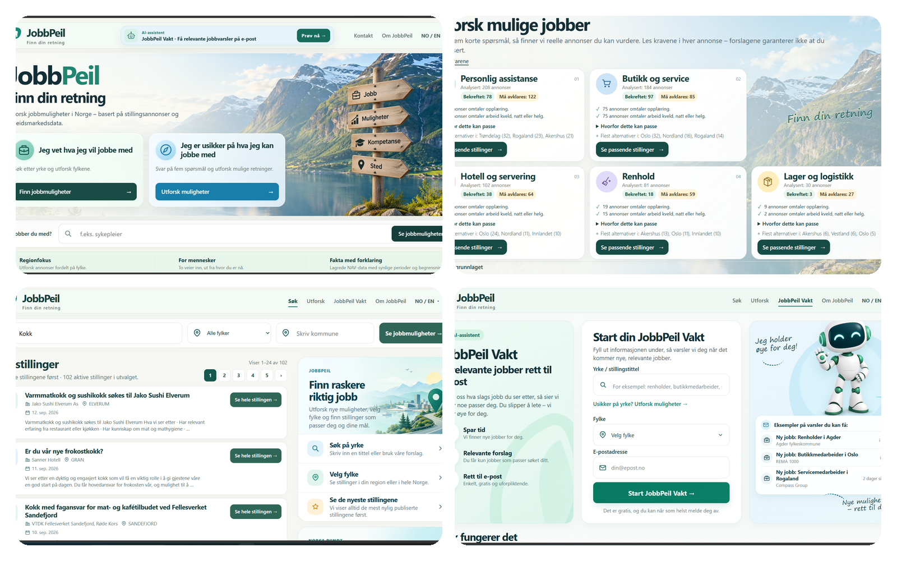
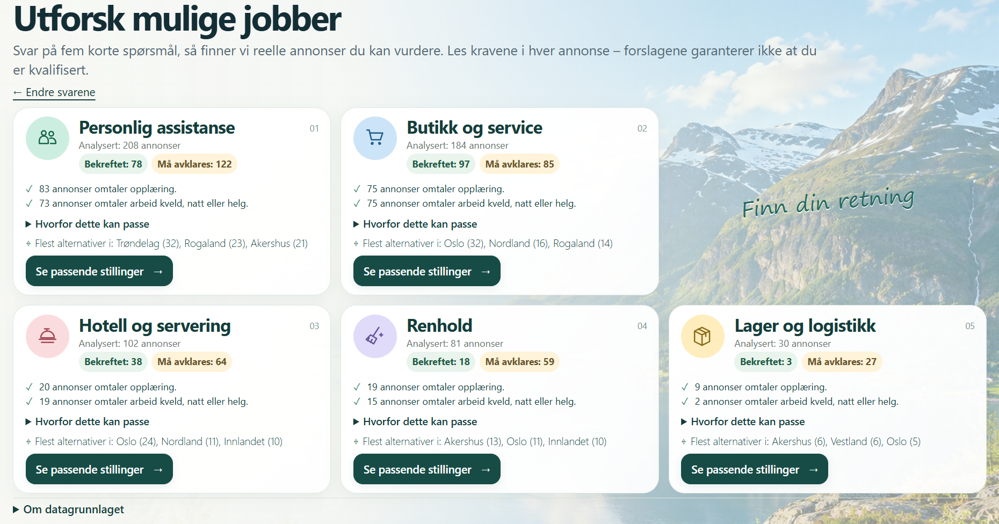
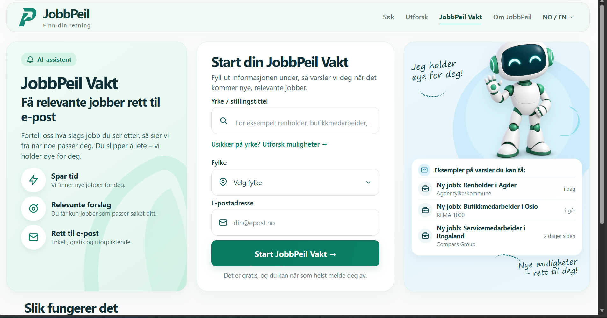

# JobbPeil

**Finn din retning**

JobbPeil is a Norwegian job-search and labour-market navigation platform that helps users find real vacancies, explore possible directions, and receive relevant job alerts.

**Live:** https://jobbpeil.no

## What JobbPeil does

- Search real vacancies from NAV / Arbeidsplassen
- Filter by profession, fylke and kommune
- Explore possible job directions through 5 short questions
- Compare directions based on real vacancy data
- Open detailed vacancy pages with application/contact handling
- Subscribe to **JobbPeil Vakt** for relevant email alerts
- Prevent duplicate alerts and repeated daily sends
- Run as a real production service on an Ubuntu VPS

## Product flow

### Home

### Explore results
The Explore flow analyses real vacancies and presents practical directions with counts, signals and regional opportunities.

### Vacancy search
Users can search directly and filter by region or municipality.

### JobbPeil Vakt
Users can subscribe to a profession and fylke and receive email alerts when new relevant vacancies appear.

## Tech stack

- Python
- SQLite
- Server-side rendered HTML
- Custom vacancy matching
- Ubuntu VPS
- Nginx
- systemd
- HTTPS / Let's Encrypt
- SMTP
- Google Analytics 4

## JobbPeil Vakt

- runs daily at 08:00 Europe/Oslo
- processes only verified active subscriptions
- sends up to 4 vacancies per email
- does not resend the same vacancy
- sends at most one alert email per subscription per day
- sends nothing when there are no new relevant vacancies

## Data sources

Current source:
- NAV / Arbeidsplassen

Planned:
- SSB labour-market statistics
- additional trusted Norwegian labour-market sources

## Security and production

- SSH key authentication
- password SSH login disabled
- root SSH login disabled
- UFW firewall
- fail2ban
- HTTPS
- HSTS
- Content Security Policy
- secrets stored outside the repository

## Testing

Automated tests cover vacancy search, pagination, filters, Explore, application/contact handling, Vakt verification, candidate matching, deduplication and daily send guard.

**91 tests passing**

## My role

I designed and built JobbPeil as an end-to-end project, including product concept, UX structure, backend development, vacancy search and filtering, matching logic, email alerts, production deployment, server configuration, analytics, testing and debugging.

## Status

JobbPeil is live and under active development.

https://jobbpeil.no
